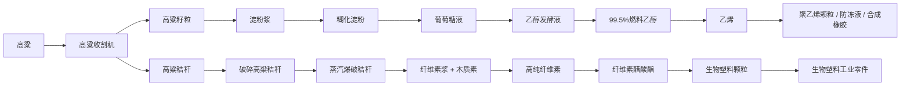

# UltraTech 古法工业与高粱生物塑料系统报告

日期：2026-07-08

## 参考仓库确认内容

本次只基于本地仓库 `C:\ASDUST` 与 `C:\creative-craft` 中能直接看到的代码与资源做提取，不把未出现的内容写成参考仓库既有机制。

### ASDUST 古法工业

从 `C:\ASDUST` 中确认到的古法系统包括：

- 原始工艺机器 `machinecraft`：包含加水加工、混合、制坯等手工流程。
- 简易窑炉 `simple_kiln`：用于烧制砖坯、陶器、草木灰、石灰等。
- 古法材料链：混合砂浆球、黄土、草木灰、煤球、生石灰、熟石灰、砖坯、烧结砖、炉砖、陶碗、陶罐、黏土锭模。
- 古法矿粉链：锡石粉、孔雀石粉、方铅矿粉、粗炼青铜锭。

UltraTech 实现中将这些内容落入独立模块 `primitive`，注册为 `PRIMITIVE_INDUSTRY_ITEMS` 与古法机器，不依赖高粱、生物塑料或 CreativeCraft 作物。

### CreativeCraft 作物与蒸汽破碎

从 `C:\creative-craft` 中确认到：

- 高粱作物、种子、产物：`sorghum_crop`、`sorghum_seeds`、`sorghum`。
- 蓝莓作物、种子、产物：`blueberry_crop`、`blueberry_seeds`、`blueberry`。
- 金盏花方块与盆栽资源：`calendula`、`potted_calendula`。
- 蒸汽动力破碎机 `steam_power_crusher` 及相关资源。

UltraTech 已迁移高粱、蓝莓、金盏花贴图资源。其中高粱在 UltraTech 中保持两格高作物逻辑，因此使用 CreativeCraft 高粱阶段贴图拆分为上下半贴图；蓝莓使用 CreativeCraft 阶段贴图；金盏花作为可种植作物加入 UltraTech。

## UltraTech 本次实现

### 作物

- 新增 `calendula`、`calendula_seeds`、`calendula_crop`。
- 高粱与蓝莓贴图改用 `C:\creative-craft` 中已有资源。
- 金盏花使用 CreativeCraft 的 `calendula.png` 派生成作物阶段贴图。
- 补齐作物模型、掉落表、种子回收配方、创造栏与中英文键值。

### 古法工业模块

新增古法机器：

- 古法砂浆工作台
- 古法土窑
- 古法研磨机
- 古法木质储罐
- 古法陶制储罐

新增古法处理配方覆盖：

- 黄土、杂质残渣
- 混合砂浆球
- 煤球
- 生石灰、熟石灰
- 砖坯、烧结砖、炉砖
- 陶碗、陶罐
- 锡石粉、孔雀石粉、方铅矿粉
- 粗炼青铜锭

### 高粱生物塑料模块

新增高粱生物塑料机器：

- 高粱收割机
- 高粱破碎机
- 淀粉分离器
- 液化反应器
- 糖化罐
- 发酵罐
- 分子筛脱水塔
- 蒸汽爆破机
- 碱处理槽
- 漂白系统
- 热解反应器
- 活化炉
- 乙烯合成塔
- 聚合反应器
- 乙二醇生产线
- 合成橡胶生产线
- 酯化反应釜
- 纺丝机
- 生物塑料成型机

新增处理链：

## 隔离原则

- 古法模块物品位于 `PRIMITIVE_INDUSTRY_ITEMS`，机器位于 `primitive_*`，处理配方路径为 `industrial_process/primitive/...`。
- 高粱生物塑料模块物品位于 `SORGHUM_BIOPLASTIC_ITEMS`，机器位于高粱/化工命名空间，处理配方路径为 `industrial_process/sorghum/...`。
- 两个模块只共用 UltraTech 通用机器基类、菜单、屏幕、配方序列化器，不互相依赖专属物品或专属机器。

## 验证

- `node` JSON 解析：`en_us.json`、`zh_cn.json` 均通过。
- `.\gradlew.bat runData`：通过，生成作物、机器、处理配方、模型、贴图、loot。
- 后续仍建议进入 `runClient` 抽查：金盏花作物阶段、高粱上下半贴图衔接、古法机器 GUI、流体输入/输出方向。
